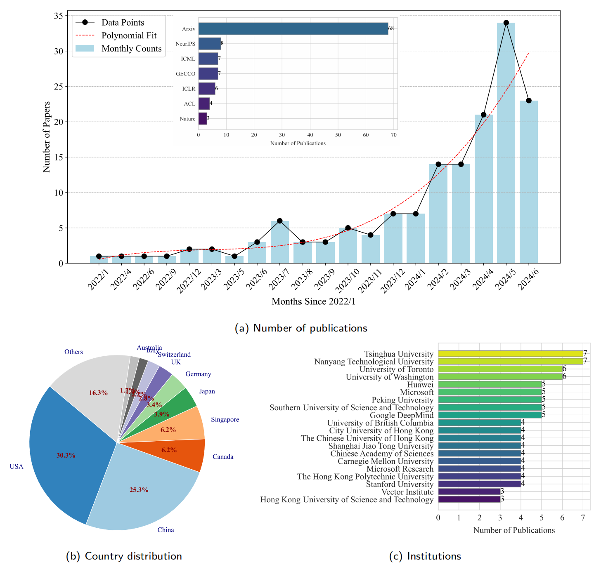
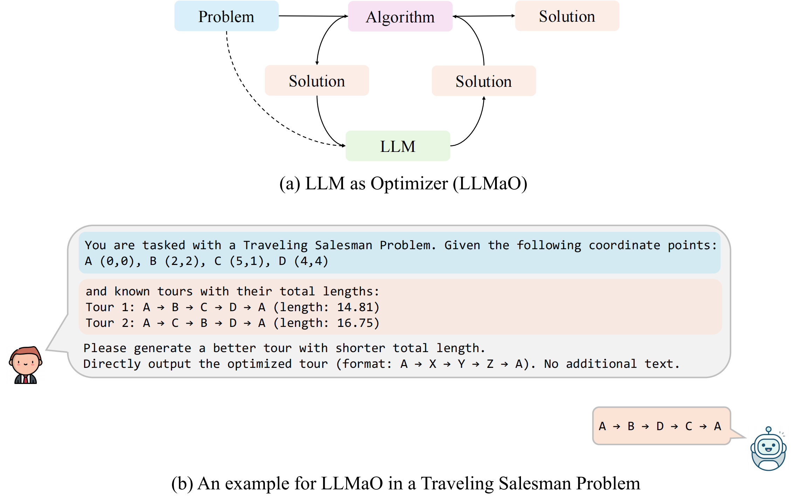
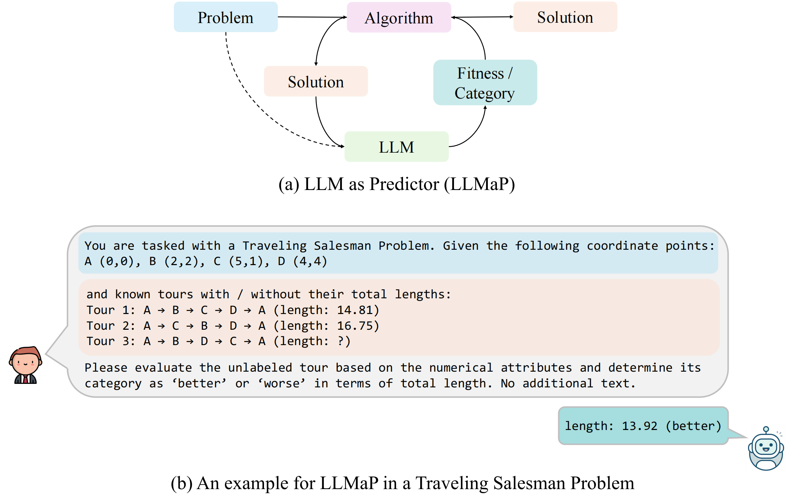
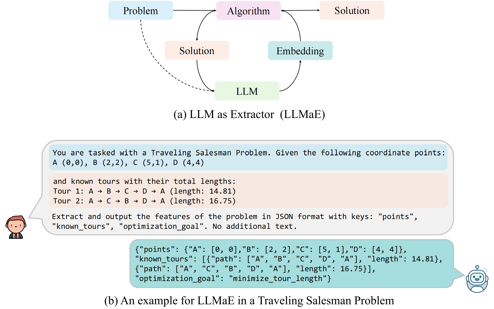
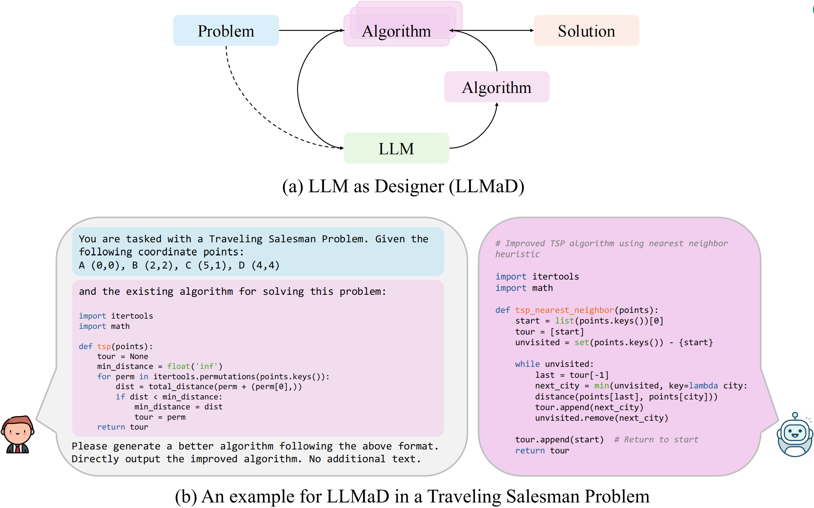

# LLM4AlgorithmDesign
## Collection on Algorithm Design with Large Language Models. "Formerly known as LLM4Opt"

🔥 Applying Large language models (**LLMs**) for algorithm design (**AD**) is an emerging research area. This is a collection of references and papers of **LLM4AD** (with focus on optimization algorithms, original name LLM4Opt). The Papers are sorted by time (first publicly available). 

**For more details, please see our survey paper:**
*   [A Systematic Survey on Large Language Models for Algorithm Design](https://arxiv.org/abs/2410.14716) (2024)

**Video Introductions and Slides:**
*   [English Webinar (IEEE CIS)](https://cis.taskforce.ieee.org/esco/webinar-series/esco-webinar-26/)
*   [Chinese Introduction (中文视频介绍)](https://www.bilibili.com/video/BV1XTJVz9Ew1)
*   
**Any suggestions and pull requests are welcomed!**

It is far from a comprehensive list. If you want to update the list:

+ Fork, Add, and Merge
+ Report an [issue](https://github.com/FeiLiu36/LLM4Opt/issues)
+ Contact Fei Liu (fliu36-c@my.cityu.edu.hk)
  

The sharing principle of these references here is for research. If any authors do not want their paper to be listed here, please feel free to contact us.

## Overview

* [Platform](https://github.com/FeiLiu36/LLM4Opt#Platform)
* [Course](https://github.com/FeiLiu36/LLM4Opt#Course)
* [Tutorial](https://github.com/FeiLiu36/LLM4Opt#Tutorial&Workshop)
* [Competition](https://github.com/FeiLiu36/LLM4Opt#Competition)
* [Special Issues](https://github.com/FeiLiu36/LLM4Opt#SpecialIssues)
* [Research Papers in Four Paradigms](https://github.com/FeiLiu36/LLM4Opt#PapersFourParadigms)
* [Research Papers](https://github.com/FeiLiu36/LLM4Opt#Papers)
  * [Review](https://github.com/FeiLiu36/LLM4Opt#Review)
  * [Position Paper](https://github.com/FeiLiu36/LLM4Opt#position-paper)
  * [Algorithm/Heuristic/Function Search](https://github.com/FeiLiu36/LLM4Opt#algorithm/heuristic/function-search)
  * [LLM as optimizer](https://github.com/FeiLiu36/LLM4Opt#llm-as-optimizer)
  * [Code Generation](https://github.com/FeiLiu36/LLM4Opt#code-generation)
  * [Prompt Opt.](https://github.com/FeiLiu36/LLM4Opt#prompt-opt)
  * [Machine Learning](https://github.com/FeiLiu36/LLM4Opt#machine-learning)
  * [Science](https://github.com/FeiLiu36/LLM4Opt#science)
  * [Industry](https://github.com/FeiLiu36/LLM4Opt#industry)
* [Related Collections](https://github.com/FeiLiu36/LLM4Opt#related-collections)

## Platform
| Project                                         | Description                                     |
|------------------------------------------------------|-------------------------------------------------|
| [LLM4AD](https://github.com/Optima-CityU/LLM4AD)  | Open-source Python-based Platform leveraging Large Language Models (LLMs) for Automatic Algorithm Design (AD) with 100+ tasks and 10+ methods|
| [BLADE](https://github.com/XAI-liacs/BLADE)  | Benchmarking LLM-driven Automated Design and Evolution of Iterative Optimization Heuristics|
| [EASE](https://github.com/TBU-AILab/EASE)  | Effortless Algorithmic Solution Evolution is a framework that leverages Large Language Models (LLMs) to generate solutions (algorithms, text, images, etc.) based on user-defined parameters. It provides a flexible and adaptive approach to automated problem-solving.|

## Course
| Course                                         | Description                                     |
|------------------------------------------------------|-------------------------------------------------|
| [2024 Fall, LLM Agents](https://llmagents-learning.org/f24)  | LLM basics and LLM for agents |

## Tutorial&Workshop
| Event                                                | Link                                                     |
|------------------------------------------------------|------------------------------------------------------------------|
| NeurIPS 2023 Workshop: Foundation Models for Decision Making | [Link](https://nips.cc/virtual/2023/workshop/66525)            |
| AAAI 2024 Workshop: Public Sector LLMs: Algorithmic and Sociotechnical Design | [Link](https://publlm.github.io/)                             |
| GECCO 2024 Workshop: Large Language Models for and with Evolutionary Computation (LLMfwEC) | [Link](https://sites.google.com/view/llmfwec-2024)              |
| GECCO 2024 Workshop: EGML-EC — 3rd GECCO workshop on Enhancing Generative Machine Learning with Evolutionary Computation (EGML-EC) 2024 | [Link](https://sites.google.com/view/egml-ec2024)            |
| GECCO 2024 Tutorial: Using Large Language Models for Evolutionary Search | [Tutorial Link](https://gecco-2024.sigevo.org/Tutorials), [Tutorial Report Link](https://arxiv.org/pdf/2401.07102) |
| PPSN 2024 Tutorial: Large Language Models as Tools for Metaheuristic Design: Exploring Challenges and Opportunities | [Link](https://ppsn2024.fh-ooe.at/program/)                   |
| KDD 2024 Tutorial: NL2Code-Reasoning and Planning with LLM for Code Development | [Link](https://kdd2024.kdd.org/workshops/), [Link](https://genetasefa.github.io/dl4kg2024/) |
| ICML 2024 Workshop: AI for Math                      | [Link](https://sites.google.com/view/ai4mathworkshopicml2024)  |
| NeurIPS 2024 Workshop: Multimodal Algorithmic Reasoning (MAR) | [Link](https://marworkshop.github.io/neurips24/) |
| NeurIPS 2024 Workshop: The 4th Workshop on Mathematical Reasoning and AI | [Link](https://mathai2024.github.io/)  |

## Competition
| Event                                                | Link                                                  |
|------------------------------------------------------|------------------------------------------------------------------|
| AAAI 2024 Global Competition on Math Problem Solving and Reasoning | [Link](https://ai4ed.cc/competitions/aaai2024competition)      |
| ICML 2024 Challenges on Automated Math Reasoning       | [Link](https://sites.google.com/view/ai4mathworkshopicml2024/challenges) |
| IEEE CIS 2024 Technical Challenge FLAME – ‘Fusing Large lAnguage Models with computational intElligence’  | [Link](https://cis.ieee.org/activities/educational-activites/competitions/flame-technical-challenge-2024) |

## SpecialIssues
| Event                                                | Link                                                  |
|------------------------------------------------------|------------------------------------------------------------------|
| IEEE TETCI, Special Issue on Neural Architecture Search and Large Machine Learning Models | [Link](https://cis.ieee.org/images/files/Documents/call-for-papers/CFP-SI-LMM-final.pdf)      |
| ACM TELO, Special Issue on Integrating Evolutionary Algorithms and Large Language Models  | [Link](https://dl.acm.org/pb-assets/static_journal_pages/telo/pdf/ACM-CFP-TELO-LLMs-EAs-1717612765163.pdf) |
|IEEE TEVC, Special Issue on Evolutionary Computation Meets Large Language Models | [link](https://cis.ieee.org/images/files/Documents/call-for-papers/tevc/cfp-ECLLMs-26august2024.pdf)|
| Engineering, Special Issue on Applications of ChatGPT | [link](https://www.sciencedirect.com/journal/engineering/about/call-for-papers#applications-of-chatgpt) |

## Research Papers in Four Paradigms

1. LLM as Optimizer (LLMaO)
2. LLM as Predictor (LLMaP)
3. LLM as Extractor (LLMaE)
4. LLM as Designer (LLMaD)

### LLM as Optimizer

| Title | Authors | Venue | Year |
|-------|---------|-------|------|
| [Large Language Model-assisted Meta-optimizer for Automated Design of Constrained Evolutionary Algorithm](https://arxiv.org/abs/2509.13251) | Xu Yang, Rui Wang, Kaiwen Li, Wenhua Li, and Weixiong Huang. | arXiv | 2025 |
| [Soft Optimization with Generative Heuristics: A framework integrating optimization, simulation, and LLMs](https://papers.ssrn.com/sol3/papers.cfm?abstract_id=5436569) | Saiz, Miguel; Calvet, Laura; Lopez, David; Juan, Angel A | SSRN | 2025 |
| [PowerGraph-LLM: Novel Power Grid Graph Embedding and Optimization With Large Language Models](https://ieeexplore.ieee.org/abstract/document/11119316/) | Bernier, Fabien; Cao, Jun; Cordy, Maxime; Ghamizi, Salah | IEEE Transactions on Power Systems | 2025 |
| [Co-Evolution of Large Language Models and Configuration Strategies to Enhance Surrogate-Assisted Evolutionary Algorithm](https://dl.acm.org/doi/abs/10.1145/3711896.3736882) | Xie, Lindong; Zhang, Yang; Tang, Zhixian; Chung, Edward; Li, Genghui; Wang, Zhenkun | KDD | 2025 |
| [On the Convergence of Large Language Model Optimizer for Black-Box Network Management](https://arxiv.org/abs/2507.02689) | Hoon Lee, Wentao Zhou, Merouane Debbah, and Inkyu Lee | arXiv | 2025 |
| [Multi-uav placement for integrated access and backhauling using llm-driven optimization](https://ieeexplore.ieee.org/abstract/document/10978733/) | Wang, Yuhui; Farooq, Junaid; Ghazzai, Hakim; Setti, Gianluca | WCNC | 2025 |
| [Open and Closed Source Models for LLM-Generated Metaheuristics Solving Engineering Optimization Problem](https://link.springer.com/chapter/10.1007/978-3-031-90065-5_23) | Senkerik, Roman; Viktorin, Adam; Kadavy, Tomas; Kovac, Jozef; Janku, Peter; Pekar, Libor; Guzowski, Hubert; Smolka, Maciej; Byrski, Aleksander; Pluhacek, Michal | EvoStar | 2025 |
| [Can Large Language Models Be Trusted as Evolutionary Optimizers for Network-Structured Combinatorial Problems?](https://arxiv.org/abs/2501.15081) | Xianliang Yang, Ling Zhang, Haolong Qian, Lei Song, Jiang Bian | arXiv | 2025 |
| [Large language model based multi-objective optimization for integrated sensing and communications in UAV networks](https://arxiv.org/abs/2410.05062) | Li, Haoyun; Xiao, Ming; Wang, Kezhi; Kim, Dong In; Debbah, Merouane | IEEE Wireless Communications Letters | 2025 |
| [6G comprehensive intelligence: Network operations and optimization based on large language models](https://arxiv.org/abs/2404.18373) | Long, Sifan; Tang, Fengxiao; Li, Yangfan; Tan, Tiao; Jin, Zhengjie; Zhao, Ming; Kato, Nei | IEEE Network | 2024 |
| [An investigation on the use of Large Language Models for hyperparameter tuning in Evolutionary Algorithms](https://dl.acm.org/doi/pdf/10.1145/3638530.3664163) | Leonardo Lucio Custode; Fabio Caraffini; Anil Yaman; Giovanni Iacca | GECCO | 2024 |
| [The Importance of Directional Feedback for LLM-based Optimizers](http://arxiv.org/abs/2405.16434) | Nie, Allen; Cheng, Ching-An; Kolobov, Andrey; Swaminathan, Adith | NeurIPS | 2024 |
| [Large Language Models for Automated Open-domain Scientific Hypotheses Discovery](http://arxiv.org/abs/2309.02726) | Yang, Zonglin; Du, Xinya; Li, Junxian; Zheng, Jie; Poria, Soujanya; Cambria, Erik | ACL | 2024 |
| [Automatic Instruction Evolving for Large Language Models](http://arxiv.org/abs/2406.00770) | Zeng, Weihao; Xu, Can; Zhao, Yingxiu; Lou, Jian-Guang; Chen, Weizhu | ACL | 2024 |
| [Synthesizing Programmatic Reinforcement Learning Policies with Large Language Model Guided Search](http://arxiv.org/abs/2405.16450) | Liu, Max; Yu, Chan-Hung; Lee, Wei-Hsu; Hung, Cheng-Wei; Chen, Yen-Chun; Sun, Shao-Hua | ICLR | 2024 |
| [Luminate: Structured Generation and Exploration of Design Space with Large Language Models for Human-AI Co-Creation](http://arxiv.org/abs/2310.12953) | Suh, Sangho; Chen, Meng; Min, Bryan; Li, Toby Jia-Jun; Xia, Haijun | Proceedings of the CHI Conference on Human Factors in Computing Systems | 2024 |
| [Large Language Model-Aided Evolutionary Search for Constrained Multiobjective Optimization](http://arxiv.org/abs/2405.05767) | Wang, Zeyi; Liu, Songbai; Chen, Jianyong; Tan, Kay Chen | ICIC | 2024 |
| [Unleashing the Potential of Large Language Models as Prompt Optimizers: An Analogical Analysis with Gradient-based Model Optimizers](http://arxiv.org/abs/2402.17564) | Tang, Xinyu; Wang, Xiaolei; Zhao, Wayne Xin; Lu, Siyuan; Li, Yaliang; Wen, Ji-Rong | AAAI | 2024 |
| [Evolving Interpretable Visual Classifiers with Large Language Models](http://arxiv.org/abs/2404.09941) | Chiquier, Mia; Mall, Utkarsh; Vondrick, Carl | CoRR | 2024 |
| [Exploring the True Potential: Evaluating the Black-box Optimization Capability of Large Language Models](http://arxiv.org/abs/2404.06290) | Huang, Beichen; Wu, Xingyu; Zhou, Yu; Wu, Jibin; Feng, Liang; Cheng, Ran; Tan, Kay Chen | CoRR | 2024 |
| [Large Language Model for Multi-objective Evolutionary Optimization](http://arxiv.org/abs/2310.12541) | Liu, Fei; Lin, Xi; Wang, Zhenkun; Yao, Shunyu; Tong, Xialiang; Yuan, Mingxuan; Zhang, Qingfu | EMO | 2024 |
| [Large Language Model-Based Evolutionary Optimizer: Reasoning with elitism](http://arxiv.org/abs/2403.02054) | Brahmachary, Shuvayan; Joshi, Subodh M.; Panda, Aniruddha; Koneripalli, Kaushik; Sagotra, Arun Kumar; Patel, Harshil; Sharma, Ankush; Jagtap, Ameya D.; Kalyanaraman, Kaushic | Neurocomputing | 2024 |
| [Large Language Models As Evolution Strategies](http://arxiv.org/abs/2402.18381) | Lange, Robert Tjarko; Tian, Yingtao; Tang, Yujin | GECCO | 2024 |
| [Connecting Large Language Models with Evolutionary Algorithms Yields Powerful Prompt Optimizers](http://arxiv.org/abs/2309.08532) | Guo, Qingyan; Wang, Rui; Guo, Junliang; Li, Bei; Song, Kaitao; Tan, Xu; Liu, Guoqing; Bian, Jiang; Yang, Yujiu | ICLR | 2024 |
| [From Large Language Models and Optimization to Decision Optimization CoPilot: A Research Manifesto](http://arxiv.org/abs/2402.16269) | Wasserkrug, Segev; Boussioux, Leonard; Hertog, Dick den; Mirzazadeh, Farzaneh; Birbil, Ilker; Kurtz, Jannis; Maragno, Donato | Arxiv | 2024 |
| [Large Language Model Agent for Hyper-Parameter Optimization](http://arxiv.org/abs/2402.01881) | Liu, Siyi; Gao, Chen; Li, Yong | Arxiv | 2024 |
| [Are Large Language Models Good Prompt Optimizers?](http://arxiv.org/abs/2402.02101) | Ma, Ruotian; Wang, Xiaolei; Zhou, Xin; Li, Jian; Du, Nan; Gui, Tao; Zhang, Qi; Huang, Xuanjing | Arxiv | 2024 |
| [DrugAssist: A Large Language Model for Molecule Optimization](http://arxiv.org/abs/2401.10334) | Ye, Geyan; Cai, Xibao; Lai, Houtim; Wang, Xing; Huang, Junhong; Wang, Longyue; Liu, Wei; Zeng, Xiangxiang | Arxiv | 2023 |
| [Using Large Language Models for Hyperparameter Optimization](https://openreview.net/forum?id=FUdZ6HEOre) | Zhang, Michael R.; Desai, Nishkrit; Bae, Juhan; Lorraine, Jonathan; Ba, Jimmy | NeurIPS | 2023 |
| [Automatic Prompt Optimization with “Gradient Descent” and Beam Search](https://arxiv.org/pdf/2305.03495) | Reid Pryzant, Dan Iter, Jerry Li, Yin Tat Lee, Chenguang Zhu, Michael Zeng | EMNLP | 2023 |
| EvoPrompting: Language Models for Code-Level Neural Architecture Search | Chen, Angelica; Dohan, David M | NeurIPS | 2023 |
| [Large Language Models Are Human-Level Prompt Engineers](https://arxiv.org/abs/2211.01910) | Yongchao Zhou, Andrei Ioan Muresanu, Ziwen Han, Keiran Paster, Silviu Pitis, Harris Chan, Jimmy Ba | ICLR | 2022 |

### LLM as Predictor

| Title | Authors | Venue | Year |
|-------|---------|-------|------|
| [Large Language Models as End-to-end Combinatorial Optimization Solvers](https://arxiv.org/abs/2509.16865) | Xia Jiang, Yaoxin Wu, Minshuo Li, Zhiguang Cao, and Yingqian Zhang | arXiv | 2025 |
| [MORA-LLM: Enhancing Multi-Objective Optimization Recommendation Algorithm by Integrating Large Language Models](https://ieeexplore-ieee-org.ezproxy.cityu.edu.hk/document/11173420) | Yuanyuan  Ge, Likang Wu, Haipeng Yang, Fan Cheng, Hongke Zhao, and Lei Zhang | TEVC | 2025 |
| [Ontology matching with large language models and prioritized depth-first search](https://arxiv.org/abs/2501.11441v2) | Taboada, Maria; Martinez, Diego; Arideh, Mohammed; Mosquera, Rosa | Information Fusion | 2025 |
| [Analysing Utterances in LLM-Based User Simulation for Conversational Search](https://dl.acm.org/doi/10.1145/3650041) | Sekulić, Ivan; Alinannejadi, Mohammad; Crestani, Fabio | ACM Transactions on Intelligent Systems and Technology | 2024 |
| [Direct Preference Optimization of Video Large Multimodal Models from Language Model Reward](http://arxiv.org/abs/2404.01258) | Zhang, Ruohong; Gui, Liangke; Sun, Zhiqing; Feng, Yihao; Xu, Keyang; Zhang, Yuanhan; Fu, Di; Li, Chunyuan; Hauptmann, Alexander; Bisk, Yonatan; Yang, Yiming | ACL | 2024 |
| [X-LoRA: Mixture of Low-Rank Adapter Experts, a Flexible Framework for Large Language Models with Applications in Protein Mechanics and Molecular Design](http://arxiv.org/abs/2402.07148) | Buehler, Eric L.; Buehler, Markus J. | APL Machine Learning | 2024 |
| [SayCanPay: Heuristic Planning with Large Language Models Using Learnable Domain Knowledge](https://ojs.aaai.org/index.php/AAAI/article/view/29991) | Hazra, Rishi; Martires, Pedro Zuidberg Dos; Raedt, Luc De | AAAI | 2024 |
| [Label-free Node Classification on Graphs with Large Language Models (LLMS)](http://arxiv.org/abs/2310.04668) | Chen, Zhikai; Mao, Haitao; Wen, Hongzhi; Han, Haoyu; Jin, Wei; Zhang, Haiyang; Liu, Hui; Tang, Jiliang | ICLR | 2024 |
| [Using Imperfect Surrogates for Downstream Inference: Design-based Supervised Learning for Social Science Applications of Large Language Models](http://arxiv.org/abs/2306.04746) | Egami, Naoki; Hinck, Musashi; Stewart, Brandon M.; Wei, Hanying | NeurIPS | 2024 |
| [CodonBERT: Large Language Models for mRNA design and optimization](https://www.biorxiv.org/content/10.1101/2023.09.09.556981v2) | Li, Sizhen; Moayedpour, Saeed; Li, Ruijiang; Bailey, Michael; Riahi, Saleh; Kogler-Anele, Lorenzo; Miladi, Milad; Miner, Jacob; Zheng, Dinghai; Wang, Jun; Balsubramani, Akshay; Tran, Khang; Zacharia, Minnie; Wu, Monica; Gu, Xiaobo; Clinton, Ryan; Asquith, Carla; Skaleski, Joseph; Boeglin, Lianne; Chivukula, Sudha; Dias, Anusha; Montoya, Fernando Ulloa; Agarwal, Vikram; Bar-Joseph, Ziv; Jager, Sven | NeurIPS | 2023 |
| [Navigation with Large Language Models: Semantic Guesswork as a Heuristic for Planning](https://proceedings.mlr.press/v229/shah23c.html) | Shah, Dhruv; Equi, Michael Robert; Osiński, Błażej; Xia, Fei; Ichter, Brian; Levine, Sergey | Proceedings of The 7th Conference on Robot Learning | 2023 |
| [Protein design by directed evolution guided by large language models](https://www.biorxiv.org/content/10.1101/2023.11.28.568945.abstract) | Tran, Thanh VT; Hy, Truong Son | TEVC | 2023 |
| [LLM Performance Predictors are good initializers for Architecture Search](https://openreview.net/forum?id=6wxmbTKr3t) | Jawahar, Ganesh; Abdul-Mageed, Muhammad; Lakshmanan, Laks V. S.; Ding, Dujian | ACL | 2023 |
| [Large Language Models for Supply Chain Optimization](http://arxiv.org/abs/2307.03875) | Li, Beibin; Mellou, Konstantina; Zhang, Bo; Pathuri, Jeevan; Menache, Ishai | Arxiv | 2023 |
| [Text2Motion: From Natural Language Instructions to Feasible Plans](https://arxiv.org/abs/2303.12153) | Kevin Lin, Christopher Agia, Toki Migimatsu, Marco Pavone, Jeannette Bohg | Autonomous Robots | 2023 |
| [Grounded Decoding: Guiding Text Generation with Grounded Models for Embodied Agents](https://arxiv.org/abs/2303.00855) | Wenlong Huang, Fei Xia, Dhruv Shah, Danny Driess, Andy Zeng, Yao Lu, Pete Florence, Igor Mordatch, Sergey Levine, Karol Hausman, Brian Ichter | NeurIPS | 2023 |
| [Exploring evolution-aware &-free protein language models as protein function predictors](https://proceedings.neurips.cc/paper_files/paper/2022/hash/fe066022bab2a6c6a3c57032a1623c70-Abstract-Conference.html) | Hu, Mingyang; Yuan, Fajie; Yang, Kevin; Ju, Fusong; Su, Jin; Wang, Hui; Yang, Fei; Ding, Qiuyang | NeurIPS | 2022 |

### LLM as Extractor

| Title | Authors | Venue | Year |
|-------|---------|-------|------|
| [Probing LLMs on Optimization Problems: Can They Recall and Interpret Problem Features](https://link.springer.com/chapter/10.1007/978-3-031-90065-5_22) | Da Ros, Francesca; Di Gaspero, Luca; Roitero, Kevin | EvoStar | 2025 |
| [STRCMP: Integrating Graph Structural Priors with Language Models for Combinatorial Optimization](https://arxiv.org/abs/2506.11057) | Xijun Li, Jiexiang Yang, Jinghao Wang, Bo Peng, Jianguo Yao, Haibing Guan | arXiv | 2025 |
| [Ask-eda: A design assistant empowered by llm, hybrid rag and abbreviation de-hallucination](https://arxiv.org/abs/2406.06575) | Shi, Luyao; Kazda, Michael; Sears, Bradley; Shropshire, Nick; Puri, Ruchir | LAD | 2025 |
| [Large Language Model-Enhanced Algorithm Selection: Towards Comprehensive Algorithm Representation](http://arxiv.org/abs/2311.13184) | Wu, Xingyu; Zhong, Yan; Wu, Jibin; Jiang, Bingbing; Tan, Kay Chen | IJCAI | 2024 |
| [BoChemian: Large Language Model Embeddings for Bayesian Optimization of Chemical Reactions](https://openreview.net/forum?id=A1RVn1m3J3) | Ranković, Bojana; Schwaller, Philippe | NeurIPS | 2023 |

### LLM as Designer

| Title | Authors | Venue | Year |
|-------|---------|-------|------|
| [Combining Large Language Models and Gradient-Free Optimizationfor Automatic Control Policy Synthesis](https://arxiv.org/abs/2510.00373) | Bosio, Carlo; Guarrera, Matteo; Sangiovanni-Vincentelli, Alberto; Mueller, Mark W | arXiv | 2025 |
| [Solve it with EASE](https://arxiv.org/abs/2509.18108) | Adam Viktorin, Tomas Kadavy, Jozef Kovac, Michal Pluhacek, and Roman Senkerik | arXiv | 2025 |
| [Re-evaluating LLM-based Heuristic Search: A Case Study on the 3D Packing Problem](https://arxiv.org/abs/2509.02297) | Guorui Quan, Mingfei Sun, and Manuel López-Ibáñez. | arXiv | 2025 |
| [HiFo-Prompt: Prompting with Hindsight and Foresight for LLM-based Automatic Heuristic Design](https://arxiv.org/abs/2508.13333) | Chen, Chentong; Zhong, Mengyuan; Sun, Jianyong; Fan, Ye; Shi, Jialong | Arxiv | 2025 |
| [LLM4CMO: Large Language Model-aided Algorithm Design for Constrained Multiobjective Optimization](https://arxiv.org/abs/2508.11871) | Zhen-Song Chen, Hong-Wei Ding, Xian-Jia Wang, and Witold Pedrycz | arXiv | 2025 |
| [LLM-enhanced Score Function Evolution for Causal Structure Learning](https://www.ijcai.org/proceedings/2025/1010.pdf) | Zidong Wang, Fei Liu, Qi Feng, Qingfu Zhang | IJCAI | 2025 |
| [Regarding Context Size in LLM-Based Metaheuristic Design](https://dl.acm.org/doi/abs/10.1145/3712255.3734351?casa_token=4N2hXC38BhcAAAAA:R3Idz_azhlbAGs-eXii7vs16D5g7dnSvq_HMXN-HpvawlhfeQGM3zwHT2ts_nzeV_YM3wGYwIxZgutk) | Adam Viktorin, Michal Pluhacek, Jozef Kovac, Tomas Kadavy, and Roman Senkerik | GECCO | 2025 |
| [A Memetic and Reflective Evolution Framework for Automatic Heuristic Design Using Large Language Models](https://www.mdpi.com/2076-3417/15/15/8735) | Qi, Fubo; Wang, Tianyu; Zheng, Ruixiang; Li, Mian | Applied Sciences | 2025 |
| [Discovering Interpretable Programmatic Policies via Multimodal LLM-assisted Evolutionary Search](https://arxiv.org/abs/2508.05433) | Qinglong Hu, Xialiang Tong, Mingxuan Yuan, Fei Liu, Zhichao Lu, and Qingfu Zhang | arXiv | 2025 |
| [Automatically discovering heuristics in a complex SAT solver with large language models](https://arxiv.org/abs/2507.22876) | Yiwen Sun, Furong Ye, Zhihan Chen, Ke Wei, and Shaowei Cai. | arXiv | 2025 |
| [Pareto-Grid-Guided Large Language Models for Fast and High-Quality Heuristics Design in Multi-Objective Combinatorial Optimization](https://arxiv.org/abs/2507.20923) | Ha, Minh Hieu; Phan, Hung; Doan, Tung Duy; Dao, Tung; Tran, Dao; Binh, Huynh Thi Thanh | Arxiv | 2025 |
| [Mela: A metacognitive llm-driven architecture for automatic heuristic design](https://arxiv.org/abs/2507.20541) | Zishang Qiu, Xinan Chen, Long Chen, and Ruibin Bai. | arXiv | 2025 |
| [CoCoEvo: Co-Evolution of Programs and Test Cases to Enhance Code Generation](https://ui.adsabs.harvard.edu/abs/2025arXiv250210802L/abstract) | Kefan Li, Yuan Yuan, Hongyue Yu, Tingyu Guo, and Shijie Cao | TEVC | 2025 |
| [EFS: Evolutionary Factor Searching for Sparse Portfolio Optimization Using Large Language Models](https://arxiv.org/abs/2507.17211) | Haochen Luo, Yuan Zhang, and Chen Liu | arXiv | 2025 |
| [DHEvo: Data-Algorithm Based Heuristic Evolution for Generalizable MILP Solving](https://arxiv.org/abs/2507.15615) | Zhihao Zhang, Siyuan Li, Chenxi Li, Feifan Liu, Mengjing Chen, Kai Li, Tao Zhong, Bo An, and Peng Liu | arXiv | 2025 |
| [Large Language Model-Aided Design of Hybrid Coa, Lshade and Mpa Inspired Algorithm](https://papers.ssrn.com/sol3/papers.cfm?abstract_id=5350853) | Ghaddar, Fatme; Ahmad, Imtiaz; Salman, Ayed; Alfailakawi, Mohammad | SSRN | 2025 |
| [Behaviour space analysis of llm-driven meta-heuristic discovery](https://arxiv.org/abs/2507.03605) | Niki van Stein, Haoran Yin, Anna V. Kononova, Thomas Bäck, and Gabriela Ochoa | arXiv | 2025 |
| [LLM-Driven Neighborhood Search for Efficient Heuristic Design](https://ieeexplore-ieee-org.ezproxy.cityu.edu.hk/abstract/document/11043025/) | Zhuoliang Xie; Fei Liu; Zhenkun Wang; Qingfu Zhang | CEC | 2025 |
| [HeurAgenix: Leveraging LLMs for Solving Complex Combinatorial Optimization Challenges](https://arxiv.org/abs/2506.15196) | Yang, Xianliang; Song, Lei; Zhang, Yapu; Bian, Jiang | Arxiv | 2025 |
| [AlphaEvolve: A coding agent for scientific and algorithmic discovery](https://arxiv.org/abs/2506.13131) | Alexander Novikov, Ngân Vũ, Marvin Eisenberger, Emilien Dupont, Po-Sen Huang, Adam Zsolt Wagner, Sergey Shirobokov, Borislav Kozlovskii, Francisco J. R. Ruiz, Abbas Mehrabian, M. Pawan Kumar, Abigail See, Swarat Chaudhuri, George Holland, Alex Davies, Sebastian Nowozin, Pushmeet Kohli, Matej Balog | arXiv | 2025 |
| [HeuriGym: An Agentic Benchmark for LLM-Crafted Heuristics in Combinatorial Optimization](https://arxiv.org/abs/2506.07972) | Hongzheng Chen, Yingheng Wang, Yaohui Cai, Hins Hu, Jiajie Li, Shirley Huang, Chenhui Deng, Rongjian Liang, Shufeng Kong, Haoxing Ren, Samitha Samaranayake, Carla P. Gomes, Zhiru Zhang | arXiv | 2025 |
| [EALG: Evolutionary Adversarial Generation of Language Model-Guided Generators for Combinatorial Optimization](https://arxiv.org/abs/2506.02594) | Duan, Ruibo, Yuxin Liu, Xinyao Dong, and Chenglin Fan | arXiv | 2025 |
| [Llm-driven instance-specific heuristic generation and selection](https://arxiv.org/abs/2506.00490) | Zhang, Shaofeng; Liu, Shengcai; Lu, Ning; Wu, Jiahao; Liu, Ji; Ong, Yew-Soon; Tang, Ke | Arxiv | 2025 |
| [Generalizable Heuristic Generation Through Large Language Models with Meta-Optimization](https://arxiv.org/abs/2505.20881) | Yiding Shi, Jianan Zhou, Wen Song, Jieyi Bi, Yaoxin Wu, Jie Zhang | arXiv | 2025 |
| [LLaMEA-BO: A Large Language Model Evolutionary Algorithm for Automatically Generating Bayesian Optimization Algorithms](https://arxiv.org/abs/2505.21034) | Wenhu Li, Niki van Stein, Thomas Bäck, Elena Raponi | arXiv | 2025 |
| [RedAHD: Reduction-Based End-to-End Automatic Heuristic Design with Large Language Models](https://arxiv.org/abs/2505.20242) | Nguyen Thach, Aida Riahifar, Nathan Huynh, Hau Chan | arXiv | 2025 |
| [LLM-Meta-SR: Learning to Evolve Selection Operators for Symbolic Regression](https://arxiv.org/abs/2505.18602) | Hengzhe Zhang, Qi Chen, Bing Xue, and Mengjie Zhang | arXiv | 2025 |
| [Calm: Co-evolution of algorithms and language model for automatic heuristic design](https://arxiv.org/abs/2505.12285) | Ziyao Huang, Weiwei Wu, Kui Wu, Jianping Wang, Wei-Bin Lee | arXiv | 2025 |
| [Leveraging large language models to develop heuristics for emerging optimization problems](https://arxiv.org/abs/2503.03350) | Thomas Bömer, Nico Koltermann, Max Disselnmeyer, Laura Dörr, Anne Meyer | arXiv | 2025 |
| [BLADE: Benchmark suite for LLM-driven Automated Design and Evolution of iterative optimisation heuristics](https://arxiv.org/abs/2504.20183v1) | van Stein, Niki; V. Kononova, Anna; Yin, Haoran; Back, Thomas | GECCO | 2025 |
| [Fitness landscape of large language model-assisted automated algorithm search](https://arxiv.org/abs/2504.19636) | Fei Liu, Qingfu Zhang, Jialong Shi, Xialiang Tong, Kun Mao, Mingxuan Yuan | arXiv | 2025 |
| [Enhancing decision making through the integration of large language models and operations research optimization](https://ojs.aaai.org/index.php/AAAI/article/view/35090) | Wasserkrug, Segev; Boussioux, Leonard; Den Hertog, Dick; Mirzazadeh, Farzaneh; Birbil, {\c{S}} İlker; Kurtz, Jannis; Maragno, Donato | AAAI | 2025 |
| [AutoSGNN: Automatic Propagation Mechanism Discovery for Spectral Graph Neural Networks](https://ojs.aaai.org/index.php/AAAI/article/view/34146) | Shibing Mo, Kai Wu, Qixuan Gao, Xiangyi Teng, and Jing Liu. | AAAI | 2025 |
| [Co-bench: Benchmarking language model agents in algorithm search for combinatorial optimization](https://arxiv.org/abs/2504.04310) | Weiwei Sun, Shengyu Feng, Shanda Li, Yiming Yang | arXiv | 2025 |
| [LLM-Assisted Automatic Memetic Algorithm for Lot-Streaming Hybrid Job Shop Scheduling With Variable Sublots](https://ieeexplore-ieee-org.ezproxy.cityu.edu.hk/abstract/document/10945804?casa_token=E4YzxQGkq0wAAAAA:5QuHub9QTllPzLPJ9mc2_lyE4x74Vyw0IMjqMe72q1AWbHWF_In9aO7DCkDbc3Ism5IdvnO57wY) | Rui Li, Ling Wang, Hongyan Sang, Lizhong Yao, and Lijun Pan | TEVC | 2025 |
| [Large language models powered neural solvers for generalized vehicle routing problems](https://openreview.net/forum?id=EVqlVjvlt8) | Cong Dao Tran; Cong_Dao_Tran; Quan Nguyen-Tri; Huynh Thi Thanh Binh; Hoang Thanh-Tung | ICLR | 2025 |
| [Complex LLM planning via automated heuristics discovery](https://arxiv.org/abs/2502.19295) | Hongyi Ling, Shubham Parashar, Sambhav Khurana, Blake Olson, Anwesha Basu, Gaurangi Sinha, Zhengzhong Tu, James Caverlee, Shuiwang Ji | arXiv | 2025 |
| [ARS: Automatic Routing Solver with Large Language Models](https://arxiv.org/abs/2502.15359) | Kai Li, Fei Liu, Zhenkun Wang, Xialiang Tong, Xiongwei Han, Mingxuan Yuan, Qingfu Zhang | arXiv | 2025 |
| [LASeR: Towards Diversified and Generalizable Robot Design with Large Language Models](https://openreview.net/forum?id=7mlvOHL6qJ) | Song, Junru; Yang, Yang; Xiao, Huan; Peng, Wei; Yao, Wen; Wang, Feifei | ICLR | 2025 |
| [Beyond the hype: Benchmarking llm-evolved heuristics for bin packing](https://arxiv.org/abs/2501.11411) | Kevin Sim, Quentin Renau, Emma Hart | Applications of Evolutionary Computation | 2025 |
| [Monte carlo tree search for comprehensive exploration in llm-based automatic heuristic design](https://arxiv.org/abs/2501.08603) | Zhi Zheng, Zhuoliang Xie, Zhenkun Wang, Bryan Hooi | ICML | 2025 |
| [Hsevo: Elevating automatic heuristic design with diversity-driven harmony search and genetic algorithm using llms](https://arxiv.org/abs/2412.14995v1) | Dat, Pham Vu Tuan; Doan, Long; Binh, Huynh Thi Thanh | AAAI | 2025 |
| [OptiMUS-0.3: Using large language models to model and solve optimization problems at scale](https://arxiv.org/abs/2407.19633) | AhmadiTeshnizi, Ali; Gao, Wenzhi; Brunborg, Herman; Talaei, Shayan; Lawless, Connor; Udell, Madeleine | Arxiv | 2025 |
| [Automated Design of Agentic Systems](https://arxiv.org/pdf/2408.08435) | Shengran H; Cong Lu; Jeff Clune | ICLR | 2024 |
| [LM4OPT: Unveiling the Potential of Large Language Models in Formulating Mathematical Optimization Problems](http://arxiv.org/abs/2403.01342) | Ahmed, Tasnim; Choudhury, Salimur | INFOR: Information Systems and Operational Research | 2024 |
| [Leveraging Large Language Model to Generate a Novel Metaheuristic Algorithm with CRISPE Framework](http://arxiv.org/abs/2403.16417) | Zhong, Rui; Xu, Yuefeng; Zhang, Chao; Yu, Jun | Cluster Computing | 2024 |
| [Intelligent design and optimization system for shear wall structures based on large language models and generative artificial intelligence](https://www.sciencedirect.com/science/article/pii/S235271022401564X?casa_token=YpdSGaBoxIgAAAAA:v8h0k2W5vydsXy783fXC2oJihOiadHMjO1iuX49TS8eAqmTHmhWEgdhQqOQ8tmlud162GCrUJA) | Sizhong Qin, Hong Guan, Wenjie Liao, Yi Gu, Zhe Zheng, Hongjing Xue, Xinzheng Lu | Journal of Building Engineering | 2024 |
| [Meta Large Language Model Compiler: Foundation Models of Compiler Optimization](https://arxiv.org/pdf/2407.02524) | Chris Cummins; Volker Seeker; Dejan Grubisic; Baptiste Rozière; Jonas Gehring; Gabriel Synnaev; Hugh Leather | Arxiv | 2024 |
| [Optimization modeling and verification from problemspecifications using a multi-agent multi-stage LLMframework](https://www.tandfonline.com/doi/epdf/10.1080/03155986.2024.2381306?needAccess=true) | Mahdi Mostajabdaveha, Timothy T. Yua, Rindranirina Ramamonjisona,Giuseppe Careninib, Zirui Zhoua and Yong Zhang | INFOR: Information Systems and Operational Research | 2024 |
| [Evolution of Heuristics: Towards Efficient Automatic Algorithm Design Using Large Language Model](https://openreview.net/forum?id=BwAkaxqiLB) | Liu, Fei; Xialiang, Tong; Yuan, Mingxuan; Lin, Xi; Luo, Fu; Wang, Zhenkun; Lu, Zhichao; Zhang, Qingfu | ICML | 2024 |
| [Rewriting the Code: A Simple Method for Large Language Model Augmented Code Search](http://arxiv.org/abs/2401.04514) | Li, Haochen; Zhou, Xin; Shen, Zhiqi | ACL | 2024 |
| [tnGPS: Discovering Unknown Tensor Network Structure Search Algorithms via Large Language Models (LLMs)](http://arxiv.org/abs/2402.02456) | Zeng, Junhua; Li, Chao; Sun, Zhun; Zhao, Qibin; Zhou, Guoxu | ICML | 2024 |
| [Evolve Cost-aware Acquisition Functions Using Large Language Models](https://arxiv.org/abs/2404.16906) | Yiming Yao, Fei Liu, Ji Cheng, Qingfu Zhang | PPSN | 2024 |
| [LLaMEA: A Large Language Model Evolutionary Algorithm for Automatically Generating Metaheuristics](http://arxiv.org/abs/2405.20132) | van Stein, Niki; Bäck, Thomas | TEVC | 2024 |
| [AutoSAT: Automatically Optimize SAT Solvers via Large Language Models](http://arxiv.org/abs/2402.10705) | Sun, Yiwen; Zhang, Xianyin; Huang, Shiyu; Cai, Shaowei; Zhang, BingZhen; Wei, Ke | Arxiv | 2024 |
| [Metaheuristics and Large Language Models Join Forces: Towards an Integrated Optimization Approach](http://arxiv.org/abs/2405.18272) | Sartori, Camilo Chacón; Blum, Christian; Bistaffa, Filippo; Corominas, Guillem Rodríguez | IEEE Access | 2024 |
| [ORLM: Training Large Language Models for Optimization Modeling](https://arxiv.org/abs/2405.17743v2) | Tang, Zhengyang; Huang, Chenyu; Zheng, Xin; Hu, Shixi; Wang, Zizhuo; Ge, Dongdong; Wang, Benyou | Arxiv | 2024 |
| [Generating Code World Models with Large Language Models Guided by Monte Carlo Tree Search](http://arxiv.org/abs/2405.15383) | Dainese, Nicola; Merler, Matteo; Alakuijala, Minttu; Marttinen, Pekka | NeurIPS | 2024 |
| [VerMCTS: Synthesizing Multi-Step Programs using a Verifier, a Large Language Model, and Tree Search](http://arxiv.org/abs/2402.08147) | Brandfonbrener, David; Henniger, Simon; Raja, Sibi; Prasad, Tarun; Loughridge, Chloe; Cassano, Federico; Hu, Sabrina Ruixin; Yang, Jianang; Byrd, William E.; Zinkov, Robert; Amin, Nada | NeurIPS' | 2024 |
| [Synergizing Spatial Optimization with Large Language Models for Open-Domain Urban Itinerary Planning](http://arxiv.org/abs/2402.07204) | Tang, Yihong; Wang, Zhaokai; Qu, Ao; Yan, Yihao; Hou, Kebing; Zhuang, Dingyi; Guo, Xiaotong; Zhao, Jinhua; Zhao, Zhan; Ma, Wei | KDD | 2024 |
| [L-AutoDA: Leveraging Large Language Models for Automated Decision-based Adversarial Attacks](http://arxiv.org/abs/2401.15335) | Guo, Ping; Liu, Fei; Lin, Xi; Zhao, Qingchuan; Zhang, Qingfu | GECCO | 2024 |
| [LLM and Simulation as Bilevel Optimizers: A New Paradigm to Advance Physical Scientific Discovery](http://arxiv.org/abs/2405.09783) | Ma, Pingchuan; Wang, Tsun-Hsuan; Guo, Minghao; Sun, Zhiqing; Tenenbaum, Joshua B.; Rus, Daniela; Gan, Chuang; Matusik, Wojciech | ICML | 2024 |
| [Large Language Model Agent as a Mechanical Designer](http://arxiv.org/abs/2404.17525) | Jadhav, Yayati; Farimani, Amir Barati | Arxiv | 2024 |
| [Evolutionary Reward Design and Optimization with Multimodal Large Language Models](https://openreview.net/forum?id=PwlKdPDZK4) | Narin, Ali Emre | CVPR | 2024 |
| [Bayesian Optimization with LLM-Based Acquisition Functions for Natural Language Preference Elicitation](http://arxiv.org/abs/2405.00981) | Austin, David Eric; Korikov, Anton; Toroghi, Armin; Sanner, Scott | ACM Conference on Recommender Systems | 2024 |
| [C2Ideas: Supporting Creative Interior Color Design Ideation with a Large Language Model](https://dl.acm.org/doi/full/10.1145/3613904.3642224?casa_token=nsvaAI9R_-8AAAAA%3AodS3gR39ZVfOVpMXxeJM9ajb7Y4rhQFO8zFyXUQOr3RWMoeU4apz6ZpGcDqVd9QQEBOMhxml1H-mPks) | Yihan Hou, Manling Yang, Hao Cui, Lei Wang, Jie Xu, Wei Zeng | CHI | 2024 |
| [Large language models in complex system design](https://www.cambridge.org/core/journals/proceedings-of-the-design-society/article/large-language-models-in-complex-system-design/CA17DFE47224DEEA616EC3B1CA7C12D4) |  | Proceedings of the Design Society | 2024 |
| [LLM4ED: Large Language Models for Automatic Equation Discovery](https://arxiv.org/abs/2405.07761) |  | Arxiv | 2024 |
| [Unify Graph Learning with Text: Unleashing LLM Potentials for Session Search](https://dl.acm.org/doi/abs/10.1145/3589334.3645574?casa_token=95ysODs6xYYAAAAA:EFE7qa54hBDeJtRudMGwoBU4QTcFGQSJKu7Z5us9no8Dxg5_-429Y7ekhGNeo6PepeB3RQlqMfM) | Songhao Wu, Quan Tu, Hong Liu, Jia Xu, Zhongyi Liu, Guannan Zhang, Ran Wang, Xiuying Chen, Rui YanAuthors Info & Claims | Proceedings of the ACM Web Conference 2024 | 2024 |
| [Eureka: Human-Level Reward Design via Coding Large Language Models](http://arxiv.org/abs/2310.12931) | Ma, Yecheng Jason; Liang, William; Wang, Guanzhi; Huang, De-An; Bastani, Osbert; Jayaraman, Dinesh; Zhu, Yuke; Fan, Linxi; Anandkumar, Anima | ICLR | 2024 |
| [LLM-SR: Scientific Equation Discovery via Programming with Large Language Models](https://arxiv.org/abs/2404.18400v2) | Shojaee, Parshin; Meidani, Kazem; Gupta, Shashank; Farimani, Amir Barati; Reddy, Chandan K. | ICLR | 2024 |
| [LLMatic: Neural Architecture Search via Large Language Models and Quality Diversity Optimization](http://arxiv.org/abs/2306.01102) | Nasir, Muhammad U.; Earle, Sam; Cleghorn, Christopher; James, Steven; Togelius, Julian | GECCO | 2024 |
| [Self-Organized Agents: A LLM Multi-Agent Framework toward Ultra Large-Scale Code Generation and Optimization](http://arxiv.org/abs/2404.02183) | Ishibashi, Yoichi; Nishimura, Yoshimasa | Arxiv | 2024 |
| [Large language models facilitate the generation of electronic health record phenotyping algorithms](file:///C:/Users/18729/Downloads/Large_Language_Models_Facilitate_the_Generation_of.pdf) | Chao, Yan; Henry H., Ong; Monika E., Grabowska; Matthew S. Krantz; Wu-Chen Su; Alyson L. Dickson; Josh F. Peterson; QiPing Feng; Dan M. Roden; C. Michael Stein; V. Eric Kerchberger; Brad A. Malin;  Wei-Qi We | Journal of the American Medical Informatics Association | 2024 |
| [LLM Guided Evolution -- The Automation of Models Advancing Models](http://arxiv.org/abs/2403.11446) | Morris, Clint; Jurado, Michael; Zutty, Jason | GECCO | 2024 |
| [LangProp: A code optimization framework using Large Language Models applied to driving](https://openreview.net/forum?id=JQJJ9PkdYC) | Ishida, Shu; Corrado, Gianluca; Fedoseev, George; Yeo, Hudson; Russell, Lloyd; Shotton, Jamie; Henriques, Joao F.; Hu, Anthony | ICLR | 2024 |
| [LLaMoCo: Instruction Tuning of Large Language Models for Optimization Code Generation](http://arxiv.org/abs/2403.01131) | Ma, Zeyuan; Guo, Hongshu; Chen, Jiacheng; Peng, Guojun; Cao, Zhiguang; Ma, Yining; Gong, Yue-Jiao | Arxiv | 2024 |
| [Auto MC-Reward: Automated Dense Reward Design with Large Language Models for Minecraft](https://openaccess.thecvf.com/content/CVPR2024/html/Li_Auto_MC-Reward_Automated_Dense_Reward_Design_with_Large_Language_Models_CVPR_2024_paper.html) | Li, Hao; Yang, Xue; Wang, Zhaokai; Zhu, Xizhou; Zhou, Jie; Qiao, Yu; Wang, Xiaogang; Li, Hongsheng; Lu, Lewei; Dai, Jifeng | CVPR | 2024 |
| [Identify Critical Nodes in Complex Network with Large Language Models](http://arxiv.org/abs/2403.03962) | Mao, Jinzhu; Zou, Dongyun; Sheng, Li; Liu, Siyi; Gao, Chen; Wang, Yue; Li, Yong | Arxiv | 2024 |
| [Reevo: Large language models as hyper-heuristics with reflective evolution](https://arxiv.org/abs/2402.01145) | Haoran Ye, Jiarui Wang, Zhiguang Cao, Federico Berto, Chuanbo Hua, Haeyeon Kim, Jinkyoo Park, and Guojie Song | NeurIPS | 2024 |
| [SpecLLM: Exploring Generation and Review of VLSI Design Specification with Large Language Model](http://arxiv.org/abs/2401.13266) | Li, Mengming; Fang, Wenji; Zhang, Qijun; Xie, Zhiyao | Arxiv | 2024 |
| [Algorithm Evolution Using Large Language Model](http://arxiv.org/abs/2311.15249) | Liu, Fei; Tong, Xialiang; Yuan, Mingxuan; Zhang, Qingfu | Arxiv | 2023 |
| [AutoAlign: Fully Automatic and Effective Knowledge Graph Alignment Enabled by Large Language Models](https://ieeexplore.ieee.org/abstract/document/10288249?casa_token=ujf6QBHy-FAAAAAA:wWW5LTQmJWmVtn86zm-Zl-yrT9mhazJXnjUjwOGV758J4os-oNOLluJCoRZ6GiNHEGbGhfaNS0w) |  | IEEE Transactions on Knowledge and Data Engineering | 2023 |
| [GPT4AIGChip: Towards Next-Generation AI Accelerator Design Automation via Large Language Models](https://ieeexplore.ieee.org/abstract/document/10323953?casa_token=JVPfnPCfMogAAAAA:2p9GNakPvY0ge5gYAn24D-3mQeErPI8Qqx8rDBsTgaRii-TN55QPbvb0dLqcM0xuAeF5cus) | Fu, Yonggan; Zhang, Yongan; Yu, Zhongzhi; Li, Sixu; Ye, Zhifan; Li, Chaojian; Wan, Cheng; Lin, Yingyan Celine | ICCAD | 2023 |
| [ChatGPT and Other Large Language Models as Evolutionary Engines for Online Interactive Collaborative Game Design](https://dl.acm.org/doi/10.1145/3583131.3590351) | Lanzi, Pier Luca; Loiacono, Daniele | GECCO | 2023 |
| [Leveraging Large Language Models for the Generation of Novel Metaheuristic Optimization Algorithms](https://dl.acm.org/doi/abs/10.1145/3583133.3596401?casa_token=lFjxyDTabOAAAAAA:jIbxdpnhSQe3sgawsyxE5Bj-b8RldElu4eU2ZxOwpeBxuT5NzhixRB8eOZWIj_wCkl_ip1_0cdE) |  | GECCO | 2023 |
| [Language to Rewards for Robotic Skill Synthesis](http://arxiv.org/abs/2306.08647) | Yu, Wenhao; Gileadi, Nimrod; Fu, Chuyuan; Kirmani, Sean; Lee, Kuang-Huei; Arenas, Montse Gonzalez; Chiang, Hao-Tien Lewis; Erez, Tom; Hasenclever, Leonard; Humplik, Jan; Ichter, Brian; Xiao, Ted; Xu, Peng; Zeng, Andy; Zhang, Tingnan; Heess, Nicolas; Sadigh, Dorsa; Tan, Jie; Tassa, Yuval; Xia, Fei | CoRL | 2023 |
| [ProgPrompt: Generating Situated Robot Task Plans using Large Language Models](https://arxiv.org/abs/2209.11302) | Ishika Singh, Valts Blukis, Arsalan Mousavian, Ankit Goyal, Danfei Xu, Jonathan Tremblay, Dieter Fox, Jesse Thomason, Animesh Garg | ICRA | 2022 |

## Papers in Domains

### Review

| Title | Publication with Date | Code | Paper |
|-------|-----------------------|------|-------|
| Evolutionary Computation in the Era of Large Language Model: Survey and Roadmap | Arxiv, Jan 2024 | [code] | [paper](https://arxiv.org/abs/2401.10034) |
| A Survey of Neural Code Intelligence: Paradigms, Advances and Beyond | Arxiv, Mar. 2024 | [code] | [paper](https://arxiv.org/abs/2403.14734) |
| When Large Language Model Meets Optimization | Arxiv, May 2024 | [code] | [paper](http://www.arxiv.org/pdf/2405.10098) |
| A Systematic Survey on Large Language Models for Algorithm Design | Arxiv, Oct 2024 | [code] | [paper](https://arxiv.org/abs/2410.14716) |

### Position paper

| Title | Publication with Date | Code | Paper |
|-------|-----------------------|------|-------|
| The Era OF Semantic Decoding | Arxiv, Mar. 2024 | [code] | [paper](https://arxiv.org/pdf/2403.14562) |
| Leveraging Foundational Models for Black-Box Optimization: Benefits, Challenges, and Future Directions | ICML 2024, May 2024 | [code] | [paper](https://arxiv.org/abs/2405.03547) |

### Algorithm/Heuristic/Function Search

| Title | Publication with Date | Code | Paper |
| ----- | --------------------- | ---- | ----- |
| Hypothesis Search: Inductive Reasoning with Language Models | Arxiv Sep 2023, ICLR 2024 | [code]  | [paper](https://arxiv.org/abs/2309.05660) |
| ToolChain*: Efficient Action Space Navigation in Large Language Models with A* Search | Arxiv Oct 2023, ICLR 2024 | [code]  | [paper](https://arxiv.org/abs/2310.13227) |
| Algorithm Evolution using Large Language Model | Arxiv Nov 2023 | [code](https://github.com/FeiLiu36/eoh) | [paper](https://arxiv.org/abs/2311.15249) |
| Mathematical discoveries from program search with large language models | **Nature** | [code](https://github.com/google-deepmind/funsearch) | [paper](https://www.nature.com/articles/s41586-023-06924-6) |
| Evolution of Heuristics: Towards Efficient Automatic Algorithm Design Using Large Language Model | **ICML 2024 (Oral)** | [code](https://github.com/FeiLiu36/EoH) | [paper](https://arxiv.org/abs/2401.02051) |
| ReEvo: Large Language Models as Hyper-Heuristics with Reflective Evolution | Arxiv Feb 2024, NeurIPS 2024 | [code](https://github.com/ai4co/LLM-as-HH) | [paper](https://arxiv.org/abs/2402.01145) |
| Discovering More Effective Tensor Network Structure Search Algorithms via Large Language Models (LLMs) | | [code]  | [paper](https://arxiv.org/abs/2402.02456) |
| AutoSAT: Automatically Optimize SAT Solvers via Large Language Models | Arxiv Feb 2024 | [code]  | [paper](https://arxiv.org/abs/2402.10705) |
| Large Language Models tO Enhance Bayesian Optimization | Arxiv Feb 2024, **ICLR 2024** | [code]  | [paper](https://openreview.net/pdf?id=OOxotBmGol) |
| On the Self-Verification Limitations of Large Language Models on Reasoning and Planning Tasks | Arxiv Feb 2024 | [code]  | [paper](https://arxiv.org/abs/2402.08115) |
| How Can LLM Guide RL? A Value-Based Approach | Arxiv Feb 2024 | [code](https://github.com/agentification/Language-Integrated-VI) | [paper](https://arxiv.org/abs/2402.16181) |
| LLaMoCo: Instruction Tuning of Large Language Models for Optimization Code Generation | Arxiv Mar 2024 | [code](https://anonymous.4open.science/r/LLaMoCo-5125) | [paper](https://arxiv.org/abs/2403.01131)
| Evolve Cost-aware Acquisition Functions Using Large Language Models | **PPSN 2024** | [code]  | [paper](https://arxiv.org/abs/2404.16906) |
| Benchmarking ChatGPT on Algorithmic Reasoning | Arxiv April 2024 | [code]  | [paper](https://arxiv.org/abs/2404.03441) |
| How Multimodal Integration Boost the Performance of LLM for Optimization: Case Study on Capacitated Vehicle Routing Problems | Arxiv March 2024 | [code]  | [paper](https://arxiv.org/abs/2403.01757) |
| LLM-ABR: Designing Adaptive Bitrate Algorithms via Large Language Models | Arxiv April 2024 | [code]  | [paper](https://arxiv.org/abs/2404.01617) |
| Constrained Neural Networks for Interpretable Heuristic Creation to Optimise Computer Algebra Systems | Arxiv April 2024 | [code]  | [paper](https://arxiv.org/abs/2404.17508) |
| GLHF: General Learned Evolutionary Algorithm Via Hyper Functions | Arxiv | [code]  | [paper](https://arxiv.org/pdf/2405.03728) |
| tnGPS: Discovering Unknown Tensor Network Structure Search Algorithms via Large Language Models (LLMs) | ICML 2024 | [code] | [paper](https://openreview.net/pdf?id=LVgT0ShxN5) |
| LLaMEA: A Large Language Model Evolutionary Algorithm for Automatically Generating Metaheuristics | Arxiv May 2024 | [code](https://github.com/nikivanstein/LLaMEA) | [paper](https://arxiv.org/abs/2405.20132) |
| Understanding the Importance of Evolutionary Search in Automated Heuristic Design with Large Language Models | PPSN 2024 | code | [paper](https://arxiv.org/abs/2407.10873) |
| Discovering Preference Optimization Algorithms with and for Large Language Models | Arxiv June 2024 | code | [paper](https://arxiv.org/abs/2406.08414) |
| OMNI-EPIC: Open-endedness via Models of human Notions of Interestingness with Environments Programmed in Code | Arxiv May 2024 | [code](https://omni-epic.vercel.app/) | [paper](https://arxiv.org/pdf/2405.15568)  |
| In-the-loop Hyper-Parameter Optimization for LLM-Based Automated Design of Heuristics | Arxiv Oct 2024 | [code](https://github.com/nikivanstein/LLaMEA) | [paper](https://arxiv.org/pdf/2410.16309) |

### LLM as Optimizer
| Title | Publication with Date | Code | Paper |
| ----- | ---------------------- | ---- | ------ |
| Large Language Models as Optimizers | Arxiv, Sep 2023 | [code](https://github.com/google-deepmind/opro) | [paper](https://arxiv.org/abs/2309.03409) |
| Large language model for multi-objective evolutionary optimization | Arxiv, Oct. 2023 | [code](https://github.com/FeiLiu36/LLM4MOEA) | [paper](https://arxiv.org/abs/2310.12541) |
| Large Language Models as Evolutionary Optimizers | Arxiv, Oct. 2023 | [code] | [paper](https://arxiv.org/abs/2310.19046) |
| Using Large Language Models for Hyperparameter Optimization | NeurIPS 2023 | [code] | [paper](https://arxiv.org/abs/2312.04528) |
| Large Language Models As Evolution Strategies | Arxiv, Feb. 2024 | [code] | [paper](https://arxiv.org/abs/2402.18381) |
| Large Language Model-based Evolutionary Optimizer: Reasoning with Elitism | Arxiv, Mar. 2024 | [code] | [paper](https://arxiv.org/abs/2403.02054) |
| Large Language Model-Aided Evolutionary Search for Constrained Multiobjective Optimization | Arxiv, May 9, 2024 | [code] | [paper](https://arxiv.org/pdf/2401.03038) |
| Towards Optimizing with Large Language Model | KDD 2024 | [code] | [paper](https://arxiv.org/abs/2310.05204)  |

### LLM as/for surrogate model
| Title | Publication with Date | Code | Paper |
| ----- | ---------------------- | ---- | ------ |
| Large Language Models as Surrogate Models in Evolutionary Algorithms: A Preliminary Study | Arxiv, June 2024 | [code](https://github.com/hhyqhh/LAEA.git) | [paper](https://arxiv.org/pdf/2406.10675) |
| Large Language Model-assisted Surrogate Modelling for Engineering Optimization | CAI, 2024 | [code]  | [paper](https://ieeecai.org/2024/wp-content/pdfs/540900a807/540900a807.pdf) |
| LLM Performance Predictors are good initializers for Architecture Search | Arxiv, Aug 2024 | [code] | [paper](https://arxiv.org/pdf/2310.16712) |

### Code Generation
| Title | Publication with Date | Code | Paper |
|-------|-----------------------|------|-------|
| L2MAC: LARGE LANGUAGE MODEL AUTOMATIC COMPUTER FOR EXTENSIVE CODE GENERATION | Arxiv Oct 2023, **ICLR 2024** | [code] | [paper](https://arxiv.org/abs/2310.02003) |

### Prompt Opt
| Title | Publication with Date | Code | Paper |
|-------|-----------------------|------|-------|
| Connecting Large Language Models with Evolutionary Algorithms Yields Powerful Prompt Optimizers | Arxiv Sep 2023, ICLR 2024 | [code] | [paper](https://arxiv.org/abs/2309.03409) |
| PromptAgent: Strategic Planning with Language Models Enables Expert-level Prompt Optimization | Arxiv Oct 2023, ICLR 2024 | [code] | [paper](https://arxiv.org/abs/2310.16427) |

### Machine Learning
| Title | Publication with Date | Code | Paper |
|-------|-----------------------|------|-------|
| Evolution through Large Models | Arxiv, June 2022 | [code](https://github.com/CarperAI/OpenELM) | [paper](https://arxiv.org/abs/2206.08896) |
| Think-on-Graph: Deep and Responsible Reasoning of Large Language Model on Knowledge Graph | Arxiv, July 2023, ICLR 2024 | [code] | [paper](https://arxiv.org/abs/2307.07697)|
| Evoprompting: Language models for code-level neural architecture search | NeuIPS 2023 | [code] | [paper](https://proceedings.neurips.cc/paper_files/paper/2023/file/184c1e18d00d7752805324da48ad25be-Paper-Conference.pdf) |
| Eureka: Human-Level Reward Design via Coding Large Language Models | ICLR 2024 | [code](https://github.com/eureka-research/Eureka) | [paper](https://arxiv.org/abs/2310.12931) |
| Language Model Decoding as Direct Metrics Optimization | Arxiv, Oct 2023, ICLR 2024 | [code] | [paper](https://arxiv.org/abs/2310.01041) |
| Label-free Node Classification on Graphs with Large Language Models (LLMS) | Arxiv, Oct 2023, ICLR 2024 | [code] | [paper](https://arxiv.org/abs/2310.04668) |
| L-AutoDA: Leveraging Large Language Models for Automated Decision-based Adversarial Attacks | GECCO 2024, Jan 2024 | [code] | [paper](https://arxiv.org/abs/2401.15335) |
| Data-driven Discovery with Large Generative Models | Arxiv, Feb. 2024 | [code] | [paper](https://arxiv.org/abs/2402.13610) |
| Large Language Model-driven Meta-structure Discovery in Heterogeneous Information Network | Arxiv, Feb. 2024 | [code] | [paper](https://arxiv.org/abs/2402.11518) |
| LLM Guided Evolution-The Automation of Models Advancing Models | Arxiv, Mar. 2024 | [code] | [paper](https://arxiv.org/pdf/2403.11446) |
| Identify Critical Nodes in Complex Network with Large Language Models | Arxiv, Mar. 2024 | [code] | [paper](https://arxiv.org/abs/2403.03962) |
| Evolving Interpretable Visual Classifiers with Large Language Models | Arxiv, April 2024 | [code] | [paper](https://arxiv.org/abs/2404.09941) |

### Science
| Title                                                     | Publication with Date | Code  | Paper                                                      |
|-----------------------------------------------------------|-----------------------|-------|------------------------------------------------------------|
| Exploring evolution-aware & -free protein language models as protein function predictors | NeurIPS 2022 | [code] | [paper](https://proceedings.neurips.cc/paper_files/paper/2022/hash/fe066022bab2a6c6a3c57032a1623c70-Abstract-Conference.html) |
| A Prompt-Engineered Large Language Model                   | Arxiv, Jan 2024      | [code]| [paper](https://arxiv.org/abs/2401.17788)                  |
| LLM-SR: Scientific Equation Discovery via Programming with Large Language Models | Arxiv, April 2024     | [code]| [paper](https://arxiv.org/pdf/2404.18400)                  |
| Large Language Model Agent as a Mechanical Designer       | Arxiv, April 2024     | [code]| [paper](https://arxiv.org/abs/2404.17525)                  |
| LLM and Simulation as Bilevel Optimizers: A New Paradigm to Advance Physical Scientific Discovery | Arxiv, May 2024       | [code](https://github.com/elttaes/Revisiting-PLMs) | [paper](https://arxiv.org/pdf/2405.09783)                  |
| Taming Large Language Model For Conversational Protein Design | Openreview, 2024  | [code]  |  [paper](https://openreview.net/pdf?id=sFJr7okOBi)   |
| AutoTurb: Using Large Language Models for Automatic Algebraic Model Discovery of Turbulence Closure | Arxiv, Oct. 2024| [code] | [paper](https://arxiv.org/pdf/2410.10657) |

### Industry
| Title                                                      | Publication with Date | Code  | Paper                                                                                   |
|------------------------------------------------------------|-----------------------|-------|-----------------------------------------------------------------------------------------|
| Large Language Models for Supply Chain Optimization        | Arxiv, July 2023      | [code]| [paper](https://arxiv.org/abs/2307.03875)                                              |
| How Can Large Language Models Help Humans in Design and Manufacturing | Arxiv, July 2023      | [code]| [paper](https://arxiv.org/pdf/2307.14377)                                              |
| LLM4EDA: Emerging Progress in Large Language Models for Electronic Design Automation | Arxiv, Dec. 2023       | [code]| [paper](https://arxiv.org/abs/2401.12224)                                         |

